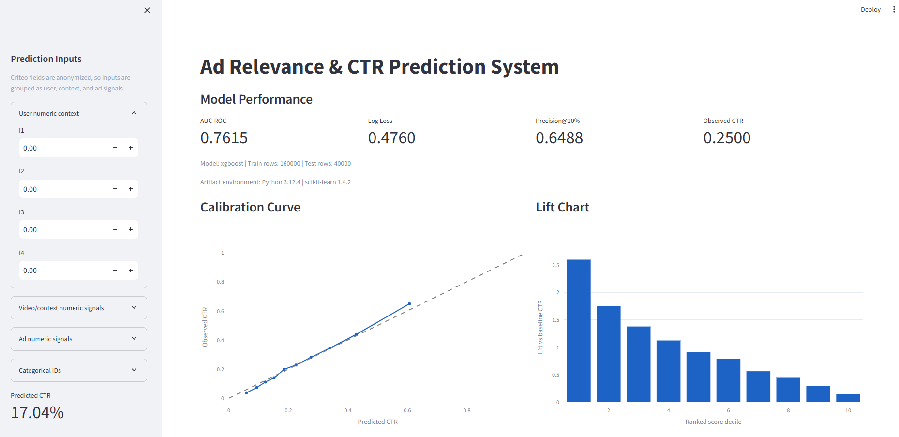

# Ad Relevance & CTR Prediction System

## Problem

This project predicts whether a user is likely to engage with an advertisement. The system combines anonymized user context, video/category context, and ad features to estimate click-through rate (CTR) for each ad impression.

## Business Relevance

CTR prediction is central to ad ranking, auction pricing, campaign optimization, and user experience. A stronger CTR model helps:

- Rank ads by expected engagement.
- Improve advertiser return on ad spend.
- Reduce irrelevant impressions for users.
- Identify feature groups that drive relevance.
- Support targeting and budget allocation decisions.

## Dataset

The project uses the Criteo CTR Prediction Dataset. The raw training file is tab-separated and contains:

- `label`: binary click outcome.
- `I1` to `I13`: anonymized integer features.
- `C1` to `C26`: anonymized categorical features.

Place the raw file at:

```text
data/raw/criteo_train.txt
```

For faster local iteration, you can use a sampled file at another path and pass it with `--data-path`.

Kaggle download command after accepting the dataset rules:

```bash
python -m kaggle competitions download -c criteo-display-ad-challenge -p data/raw
```

If using an alternate source such as Hugging Face, save the data as a tab-separated file with the same Criteo column order.

## Project Structure

```text
.
├── README.md
├── app.py
├── requirements.txt
├── assets/
├── data/
├── dashboard/
├── models/
├── notebooks/
├── reports/
└── src/
    ├── config.py
    ├── data.py
    ├── evaluate.py
    ├── explain.py
    ├── features.py
    ├── metrics.py
    ├── modeling.py
    └── train.py
```

## Methodology

The pipeline includes:

1. Load the Criteo raw tab-separated file.
2. Validate and clean labels.
3. Engineer higher-level signal groups:
   - `user_activity_score`
   - `context_intensity_score`
   - `ad_signal_score`
   - `missing_numeric_count`
   - `known_category_count`
4. Impute numeric and categorical missing values.
5. Apply log scaling and standardization to numeric features.
6. One-hot encode categorical features with rare-category grouping.
7. Train a CTR classifier.
8. Evaluate ranking quality, probabilistic accuracy, calibration, and lift.
9. Save model artifacts and dashboard inputs.

## Modeling Approach

Implemented model options:

- Logistic Regression
- Random Forest
- XGBoost
- LightGBM
- Neural Network

The default model is Logistic Regression because it is fast, interpretable, and a good first baseline for sparse categorical CTR data.

The selected final model is **XGBoost**. It provides the best overall balance of ranking quality and calibrated CTR probabilities in the current experiment.

Train the baseline:

```bash
python -m src.train --data-path data/raw/criteo_train.txt --model logistic_regression --sample-size 200000
```

Train other models:

```bash
python -m src.train --data-path data/raw/criteo_train.txt --model random_forest --sample-size 200000
python -m src.train --data-path data/raw/criteo_train.txt --model xgboost --sample-size 200000
python -m src.train --data-path data/raw/criteo_train.txt --model lightgbm --sample-size 200000
python -m src.train --data-path data/raw/criteo_train.txt --model neural_network --sample-size 200000
```

Use a larger sample after validating the pipeline locally. Set `--sample-size 0` to use all rows.

## Evaluation Metrics

The training command produces:

- AUC-ROC: ranking separation between clicked and non-clicked impressions.
- Log loss: probability quality, with heavier penalty for confident wrong predictions.
- Precision@K: click rate among the highest-scored impressions.
- Calibration curve: predicted CTR versus observed CTR.
- Lift chart: performance of ranked deciles versus baseline CTR.

Saved artifacts:

```text
models/model.joblib
models/metrics.json
models/model_metadata.json
models/feature_importance.csv
models/calibration_curve.csv
models/lift_chart.csv
```

Evaluate a trained model on another sample:

```bash
python -m src.evaluate --data-path data/raw/criteo_train.txt --model-path models/model.joblib --sample-size 100000
```

## Results

The current model comparison was run on a 200,000-row sample from the Criteo dataset with an 80/20 stratified train/test split.

| Model | AUC-ROC | Log Loss | Precision@1% | Precision@5% | Precision@10% | Mean Predicted CTR | Observed CTR |
|---|---:|---:|---:|---:|---:|---:|---:|
| Logistic Regression | 0.7557 | 0.5789 | 0.8575 | 0.7140 | 0.6213 | 0.4316 | 0.2500 |
| Random Forest | 0.7226 | 0.6464 | 0.7525 | 0.6700 | 0.5835 | 0.4853 | 0.2500 |
| XGBoost | 0.7615 | 0.4760 | 0.8775 | 0.7390 | 0.6488 | 0.2488 | 0.2500 |
| LightGBM | 0.7705 | 0.5567 | 0.8825 | 0.7645 | 0.6588 | 0.4306 | 0.2500 |
| Neural Network | 0.7624 | 0.4762 | 0.8525 | 0.7360 | 0.6398 | 0.2334 | 0.2500 |

Detailed comparison is stored in `reports/model_comparison.csv`.

### Final Model Selection

**XGBoost** is selected as the final model because it has:

- The best log loss, indicating the strongest probability estimates.
- Strong AUC-ROC and Precision@K ranking performance.
- Mean predicted CTR of 0.2488 versus observed CTR of 0.2500, which is the closest calibration among tested models.

LightGBM has the highest AUC and Precision@K, but its mean predicted CTR is much higher than observed CTR. For an ad system, calibrated probabilities are important because CTR estimates can be used for ranking, bidding, and expected-value calculations.

## Dashboard

Run the Streamlit app:

```bash
streamlit run app.py
```

The dashboard shows:

- AUC, log loss, Precision@K, and observed CTR.
- Calibration curve.
- Lift chart.
- Feature importance.
- Manual single-impression CTR scoring.

Dashboard screenshot:



If the image does not render, add your Streamlit screenshot at `assets/screenshots/xgboost_dashboard.png`.

## How To Run

Create and activate a virtual environment:

```bash
python -m venv .venv
.venv\Scripts\activate
```

Install dependencies:

```bash
pip install -r requirements.txt
```

Add the dataset:

```text
data/raw/criteo_train.txt
```

Train:

```bash
python -m src.train --data-path data/raw/criteo_train.txt --model xgboost --sample-size 200000
```

Launch the app:

```bash
streamlit run app.py
```

## Notes

The full Criteo dataset is large. Start with a sample to validate the full pipeline, then increase `--sample-size` based on local memory and training time.

## Product Insights

The dashboard and feature importance output can answer practical product questions:

- Which anonymized feature families are most predictive of engagement?
- Are high-scored impressions meaningfully better than average impressions?
- Is the model overconfident or underconfident in certain probability ranges?
- Which top deciles should receive more delivery priority?
- Does the model produce useful ranking lift beyond the baseline CTR?
- Top-ranked impressions are materially better than average impressions. XGBoost reaches 0.8775 Precision@1% versus a 0.2500 baseline CTR.
- The lift chart shows the highest-score decile has roughly 2.5x to 2.6x baseline CTR.
- XGBoost is better suited for CTR probability outputs than class-weighted Logistic Regression, Random Forest, or LightGBM in this setup.
- LightGBM is promising for ranking but needs calibration before being used for probability-sensitive decisions.

## Limitations And Next Steps

- Criteo features are anonymized, so feature importance is useful directionally but cannot be mapped directly to real user or ad attributes.
- Results are from a 200,000-row sample, not the full dataset.
- Hyperparameter tuning was intentionally light; XGBoost and LightGBM can likely improve with tuning.
- Class-weighted models overpredict CTR and should be calibrated before production use.
- Future work: add cross-validation, calibration with `CalibratedClassifierCV`, SHAP analysis, experiment tracking, and batch scoring scripts.
